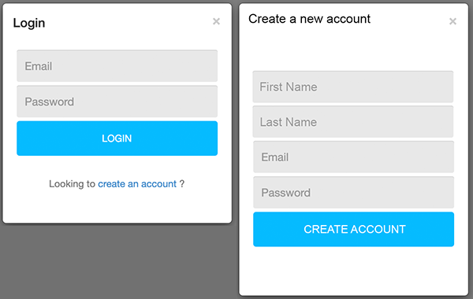
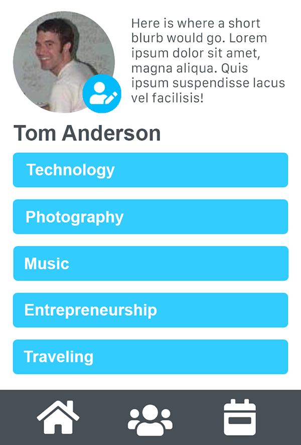
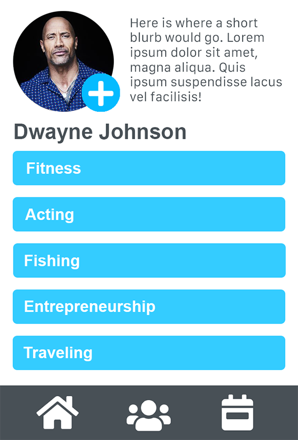
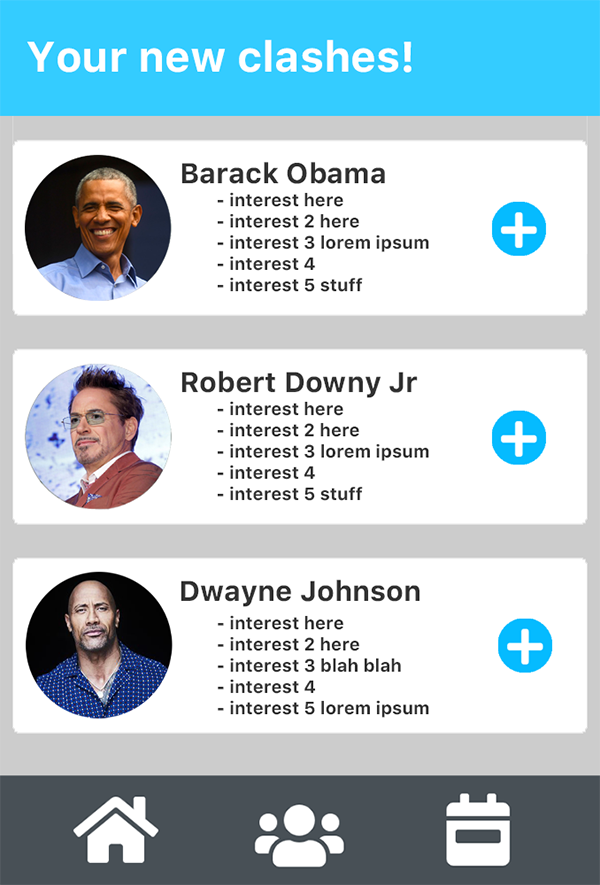

# Frienemies

## Overview
 We aim to make an app that can be used to connect people with vastly different interests, so that users can broaden their life experience and meet new people. Upon signup, users will answer questions based on their interests. Their answers will then be saved in a database and used to suggest new friends with dissimilar interests. 

## User Story
> * AS A person in a post-covid world, looking to meet new friends,
> * I WANT to meet friends with different interests,
> * SO THAT I can connect with new people and learn and experience new things.

## Npm packages
The npm package we plan on using aisre [Formidable](https://www.npmjs.com/package/formidable) for user-image uploading storage and retrival. 
We may also impliment [Randomcolor](https://www.npmjs.com/package/randomcolor) to generate colors for user profiles without a profile image.

## Database structure
* Table for users(includes user id, first name, last name, email, password, user image, and friends)
* Table for interests(include interest id, and interest name)
* Table called interest tags that contains interest ids and user ids we can use to link users and interests with a many to many relationship

## Route structure
* Basic get routes to serve the html.
* Post route to create the user data.
* Post route to login and logout.
* Post route to collect user interests.
* Post route to collect user image.
* Put route to update user interests.
* Get route to show user profile.
* Get route to show Users and their interests.
* Put route to update the Users friends object.
* Delete route to remove the user information.

## Mockup
Create Profile and Login mockup pages  

 

Your User Profile mockup  

 

Potential Friend's Profile mockup  

 

Your Recent "Clashes" mockup  

## Tasks
Front End Tasks:
* Build HTML Structure
* Apply basic CSS styling with Bootstrap
* Apply handlbars to the structure during back-end development

Back End Tasks:
* Build server
* Build out models and seed database with test data
* Build and test get and post routes with the test data
* Build and test login and logout routes
* Build delete route